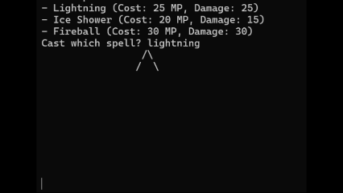
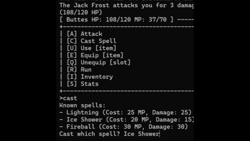
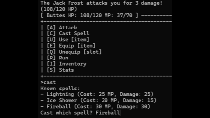
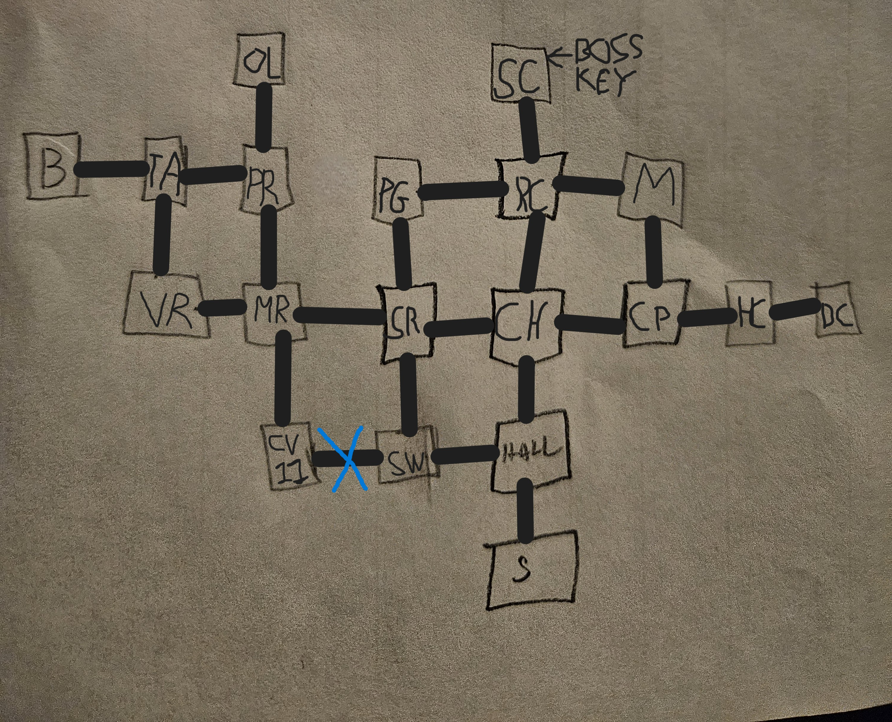
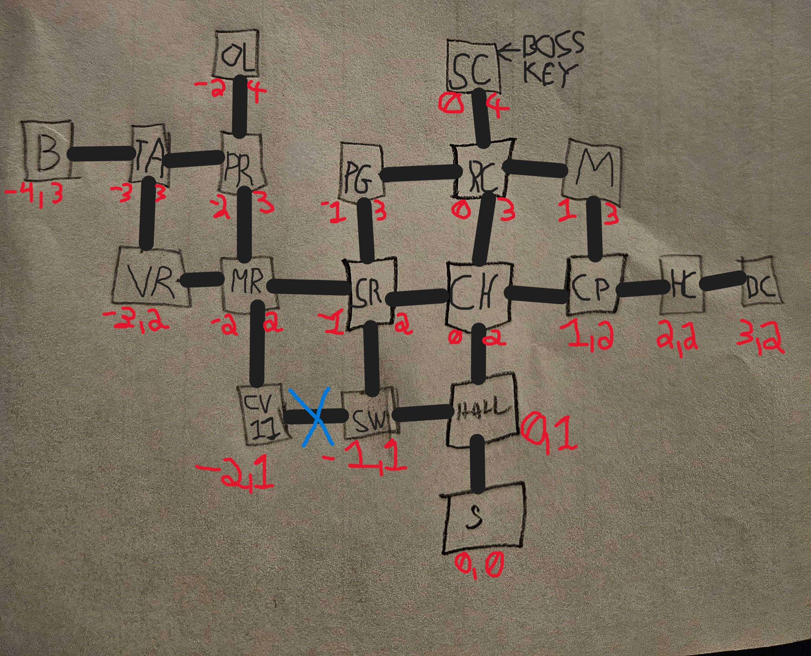

# Descent - Terminal Adventure Game

A terminal based RPG built in Python as a senior capstone project at the University of Arizona.

Descent is a text adventure with exploration, turn-based combat, inventory and equipment systems, save/load support, multi-floor maps, and optional secret character minigame abilities.

## Features

- Text command exploration (look, go, examine, take, use, equip, attack, map, save/load)
- Turn-based combat with stats, critical hits, buffs/debuffs, and loot
- Inventory and equipment management
- JSON driven world data (rooms, items, spells)
- Save/load game state to JSON files
- Multi-floor ASCII map rendering with visited-room tracking
- Secret characters with unique special abilities and combat minigames

## Tech Stack

- Python 3
- Standard library modules (json, os, sys, random, time)
- msvcrt (used for some Windows-only minigame input handling)

## Project Structure

```text
Assets/
  Data/
    rooms.json
Game/
  game.py
  main.py
Models/
  enemy.py
  item.py
  player.py
  room.py
Systems/
  combat.py
  map_renderer.py
  parser.py
  special_abilities.py
  world_loader.py
UI/
  gui.py
  widgets.py
```

## Running the Game

From the project root:

```bash
python Game/main.py
```

If your system uses `python3`:

```bash
python3 Game/main.py
```

## Gameplay Notes

- Enter commands in plain language (for example: `look`, `go north`, `take potion`, `attack rat`).
- During combat, type `special` (or `p`) to use a secret character ability, if unlocked.
- Save with `save` or `save <filename>` and load when prompted at startup.

## Spell Animation GIFs

Lightning:



Ice Shower:



Fireball:



## Screenshots

Main map snapshot:



Updated map snapshot:




## Why This Project

This project was built to practice end-to-end game development fundamentals:

- Designing data-driven game systems
- Building and balancing RPG mechanics
- Iterating on features through playtesting feedback
- Packaging and documenting software for public release

## Future Improvements

- Cross-platform replacement for Windows only minigame input paths
- Additional content expansion (rooms, enemies, abilities, endings)
- Automated tests for parser, combat calculations, and save/load integrity
- Optional richer UI mode on top of the core game logic

## Author

Patrick Good
